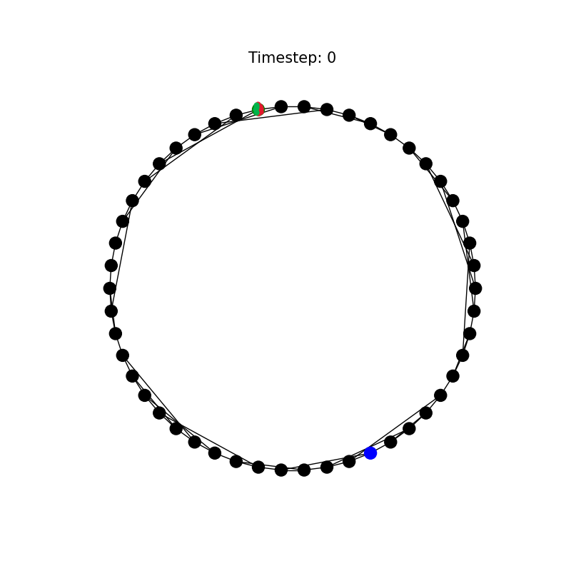
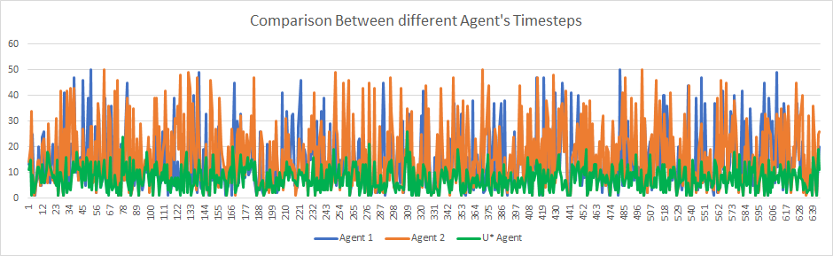
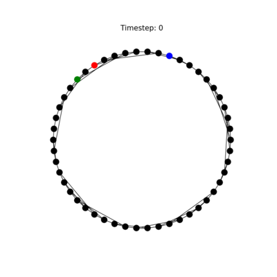

# Better, Smarter, Faster
> CS-520 (Introduction to Artificial Intelligence) Project 3  
> > By: Keshav S. (ks1830), Shashwath S. (sks272)

[Github repo](https://github.com/keshavshivkumar/bettersmarterfaster)

## Overview

- Better, smarter, faster is the third project under the Rutgers' CS-520 class taught by Dr. Charles Cowan.
- The project aims to build on top of the previous project by making the agent catch the prey in the least number of tries while avoiding the predator.

## Grey box questions

1. If we consider all the states possible, number of states = 50 \* 50 \* 50 = 125000.

    If we consider only possible starting states, number of states = 50\*1\*49 + 50\*49\*48 = 120050

2. $U^*$ is easy to determine for states:
   - Prey and Agent in same node, $U^* = 0$
   - Predator and Agent in same node, $U^* \approx \infty$
   - Agent is one step away from prey (when prey and predator are not in the same node), $U^* = 1$ since the agent is moving optimally.

# ${U^{*}}$

## Overview

- The utility, `Ustar` is defined to be the minimal expected number of rounds for the agent to catch the prey.
- With Ustar, an optimal policy can be recovered to ensure the agent can succeed in catching the prey.

## Design

- The U* for any state can be calculated using value iteration: 
    - Value Iteration in our case:
    $$U^*_{k+1}(s) = min_{a∈A(s)} [cost_{s, a}+ \beta\sum_{a∈A(s)} p_{s,s'}^a U^*_k(s') ]$$

- In our implementation $\beta = 1$ because the value of future states should not get discounted as they provide exact value of estimated steps to reach prey.
  
- $cost_{s,a} = 1$ for all steps as this would be counted as cost for agent to move.
  
- $p_{s,s'}^a = P(Prey_{s'}|Prey_s) * P(Predator_{s'}|Predator_s)$ since the states are stochastic. Prey moves randomly and Predator moves according to distracted predator model.

$$U^*_{k+1}(s) = min_{a∈A(s)} [1+ \sum_{a∈A(s)} p_{s,s'}^a U^*_k(s') ]$$

## Algorithm

Value Iteration

```python
Initialize_U*() # with any value

# repeat until convergence
for all state in states:
    for all actions in state:
        Update_U*_according_to_formula()
```

## Implementation

- The initial U(s) ∀ s ∈ state space S is set arbitrarily to a constant, 30.
- The U(s'), where s' implies the states where both the agent and predator exist, is set to a very high value as this is a loss condition. In our implementation, the U* for such a state is always set to 1,000,000 whenever encountered.
- The U(s''), where s'' implies the states where both the agent and prey exist, is set to 0 as we know .
- A prey transition matrix is stored to track the probabilities of where the prey may move to.
- The predator propogated belief is calculated for each state with respect to the agent's next position.
- The U* values converge over time using value iteration until the optimal U* values for each state are obtained. 

## The U* Agent

- Calculates the action which leads to min U* at each step and moves accordingly until game ends.
- Moves that lead to agent to the current predator position are discouraged by giving it a high cost.

## Grey box questions

1. States where agent cannot catch predator: when agent and predator start from the same node. The agent will not be able to catch prey in this situation so $U^*$ for this state is set to $\infty$.
2. Largest possible finite value of $U^*$ for our graph $\approx$ 16.707
   
   Visualization:

   

    `Agent: Blue` `Prey: Green` `Predator: Red`

3. Performance of U* (in terms of timestep to catch Prey) to `Agent 1` and `Agent 2`.

    

    Average Timesteps (measured over 600 iterations):
    - `Agent 1`: 14.3649
    - `Agent 2`: 16.7453
    - `U*Agent`: 7.58540

4. States where U* agent makes different choices:

    - Agent 1 visualization

    
    

    <br>
    - Agent 2 visualization

    
    

    <br>
    - U* Agent visualization

    
    

- On comparing the visualizations of each agent, a crucial distinction between Agent1/Agent2 and the U* Agent can be observed:
    - Since the methodology of Agent 1 and Agent 2 were hard-coded a set of rules to make their way to the prey, the agents made it equal priority to move towards the prey while keeping the distance between themselves and the predator non-decreasing at best.
    - The U* Agent had the utility precomputed, so it is aware of where it can catch the prey even if the gap between itself and the predator was closing.
    - Therefore we can notice that the agents are faced with the dilemma of moving towards the prey at the cost of moving towards the predator as well. Agent 1 and 2 are designed to avoid getting close to the predator so they move away. The U* Agent, however, moves towards the prey and predator, while knowing it can avoid the predator. 

# $V$ Model

## Overview

- The V model is a model that is built to predict the value of U*(s) for a state s ∊ state space S.

## Design

- The V model is a regression neural network model that is made of 1 input layer, 3 hidden layers and 1 output layer.
- The output layer outputs the predicted U* value for each state.
- Using the output of the V model, an agent can be constructed to attempt to catch the prey in the graph.

## Implementation

### V model

- The V model is trained using the U-table as input, which contains the calculated U* values for each state.
- The input is passed as a NumPy array of arrays. The features (columns), as specified before, are stored in each sub-array (rows).
- The output is a single node trained to predict the U* value of a given state.
- In total the number of data points are 122550. (Exclude the data points where agent and predator are in the same node)
- There are 6 features passed as `input` to the neural network: 
  - the agent's position node
  - the prey's position node
  - the predator's position node
  - the distance between the agent and prey positions
  - the distance between the prey and predator positions
  - the distance between the predator and agent positions.
- The model is trained by backpropagation using the concept of Automatic Differentiation (Suggested by Aravind Sivaramakrishnan):
  - Store values that are needed to compute gradient in each layer $\forall l ∈ [1,n]$.
  -  While backpropagating, compute the gradient of each layer $l$ using the stored value and derivative of previous layer $l+1$.
  - After gradients are calculated for each layer, update parameters of each layer with any optimizer of choice. 
  - In our case we have implemented a crude version of the Adam Optimizer
- There are 2 types of layers that are used:
    - Fully Connected Layer
    - Activation Layer
- The weight and bias are numpy arrays initialized to random standard normalized values in each FC layer.
- The activation function used is Rectified Linear Unit (ReLU) and the loss function used is Mean Absolute Error (MAE).
- The final model we settled on: 
  - Input(6) -> FClayer(24) 
  - Activation (ReLU) 
  - FClayer(24) -> FClayer(24) 
  - Activation  (ReLU)
  - FClayer(24) -> Output(1)
  - Loss (MAE loss) 

- The V model is trained for 5,000 epochs.
- Overfitting is not an issue for this model as the training set covers all possible scenarios. Any new input will not deviate from the training input.

### V Agent

- The V Agent bootstraps off the predictions made by the V model.
- Works the same as `U* Agent` but by replacing U* value with predicted U* value from V.

## Observations and Metrics

- MAE error after 5000 epochs: ~ 0.61
- The agent performed with a winrate of 100%.

## References

- [Neural Network in 100 lines](https://eisenjulian.github.io/deep-learning-in-100-lines/index.html)

## Grey Box Quesitons

Performance against `U* Agent`:
- 100% winrate, same as U* agent
- Average timesteps taken for `V Agent`: 7.605, identical to `U* Agent`

Their performances are identical to each other.

# $U_{partial}$

## Overview

- The $U_{partial}$ refers to the expected utility of a state wherein the prey's position is replaced with a vector of beliefs of where it might be.
- In this case, the prey's position is unknown. This means that the prey's different beliefs result in an infinite number of belief states that causes $U^{*}$ to be tough to compute.

## Design

- The idea here is to compute $U_{partial}$ as an estimate from $U^{*}$ as provided in the writeup:
$$U_{partial}(s_{agent}, s_{predator}, \underline{p}) = \sum_{s_{prey}} p_{s_{prey}} U^{*}(s_{agent}, s_{predator}, s_{prey})$$
- An agent is designed to follow the estimated utility generated by the aforementioned equation.

## Implementation

- The belief update (transition update) and survey belief are updated the same way as `Agent3` from project 2.
- $U_{partial}$ is calculated for each action in the value iteration.
- In this case $p_{s,s'}^a = P(Predator_{s'}|Predator_s)$


## Observations

- The agent's performance was close to the $U^*$ agent, around a 99.8% win rate.
- The average # of timesteps was 29.938.

## Grey Box Questions

1. Comparison to `Agent 3` and `Agent 4` from Project 2 (based on timesteps to catch prey):

    

    Average timesteps to catch prey:
    - `Agent 3`: 29.585
    - `Agent 4`: 38.279
    - `U partial`: 29.937

2. Is this $U_{partial}$ optimal? 

    No it is not optimal as:
    - it takes more timesteps to catch prey
    - does not have 100% winrate


- The state [`upartial`, agent_position, predator_position, prey_vector] is stored in `upartial.csv` if `upartial` < 50, since if the estimate is greater than 50, it means that the path is not an optimal one. 

# $V_{partial}$

## Overview

- Earlier, `Upartial` was estimated out of `Ustar` to provide us the estimated utility in a partial information environment (the prey's location is not known).
- A model, `Vpartial` was built to predict the $U_{partial}(s)$ value for state s.

## Design

- `Vpartial` is a neural network regression model in the same vein as `V_model`, with 1 input layer, 3 hidden layers and 1 output layer, and the output being the predicted $U_{partial}$ value.
- The difference is in the layer architecture.
- The output from the model can be used to construct the $V_{partial}$ agent.

## Implementation

### V<sub>partial</sub> model:
- The `Vpartial` model uses the same infrastructure as the V model, with the only difference in the layer architecture.
- `Vpartial` takes in 52 features as a NumPy array:
    - The agent position
    - The predator position
    - The 50 different prey beliefs
- While computing `Upartial`, the features are stored in `upartial.csv` along with the label, `upartial`.
- The final model we settled on: 
  - Input(52) -> FClayer(256) 
  - Activation (ReLU) 
  - FClayer(256) -> FClayer(256)
  - Activation  (ReLU)
  - FClayer(256) -> Output(1)
  - Loss (MAE loss) 
- The `Vpartial` model is trained over 5000 epochs.
- Overfitting becomes an issue here because there are infinite possible states due to the range of prey beliefs.
- To avoid overfitting, the training should be stopped when the training and testing losses start to vary too strongly.
- On plotting the graphs of training and testing losses, the testing loss correlated to the training loss, implying the model did not overfit.


- Model download: [download](https://rutgers.box.com/s/48nt3skqp3hxr3otkv1unkbqnww96bpl)

### V<sub>partial</sub> Agent:

- Similar to the `V_agent`, the `Vpartial_agent` bootstraps off the predictions of $U_{partial}$ made by the `Vpartial` model.
- The `V_agent` uses the predicted $U_{partial}$ value from `Vpartial` to make a move.

## Observations

- MAE error after 5000 epochs: ~ 0.37
- Win rate of the agent on average: 99.8%
- The average # of timesteps was 35.648.
- The agent may lose due to timeout.

## Grey Box Questions

- Performance against the `Upartial` agent:
    - Both perform in the same way; both win rates are always between 98-100%.


# $U_{partial}$#

## Overview

- $U_{partial}$# or `UpartialSharp` is a variant of the estimated utility.
- Instead of estimating the utility off of $U^{*}$, the utility is estimated using the predictions of the `V_model`.

## Design

- The `UpartialSharp` works very similarly to `Upartial`.
- The estimated utility is calculated using the predictions of `V`, rather than $U^{*}$.
- $$U_{partial}(s_{agent}, s_{predator}, \underline{p}) = \sum_{s_{prey}} p_{s_{prey}} V(s_{agent}, s_{predator}, s_{prey}, dist(s_{agent}, s_{prey}), dist(s_{prey}, s_{predator}), dist(s_{predator}, s_{agent}))$$ 
- Using the above equation, `UpartialSharp` is calculated.

## Implementation

- The implementation does not deviate from `Upartial`.

## Observations

- The win rate of the `UpartialSharp` Agent is around 99.8%.
- The average # of timesteps taken was 27.3775.
- There is no significant difference between the performance of `Upartial` and `UpartialSharp`.

# $V_{partial}$#

## Overview

- $V_{partial}$# or `VpartialSharp` is the neural network model built to predict the value of `UpartialSharp`.

## Design

- `VpartialSharp` does not differ from `Vpartial` except in the aspect of input.
- Similar to how `Vpartial` gets its input, `VpartialSharp` gets its input from `usharp.csv` that was generated by `UpartialSharp`.

## Implementation

- `VpartialSharp` does not differ from `Vpartial` in implementation.

- Model download: [download](https://rutgers.box.com/s/qzsrksmre17xoftzzf778n9aw0hh05l6)

## Observations

- The MAE loss converges to ~0.27
- The average win rate for the agent is 99.8%.
- The average # of timesteps was 29.3609.
- Its performance is no different from the `UpartialSharp` agent, and is thus not notably different from the `Upartial` and `Vpartial` agents.


# Bonus

1. Build a model to predict the actual utility of the Upartial agent:

    - Data: Run $U_{partial}$ Agent on all possible starting states. Each state being run 10 times
    - Model: Same model as V
    - Could not build it in time