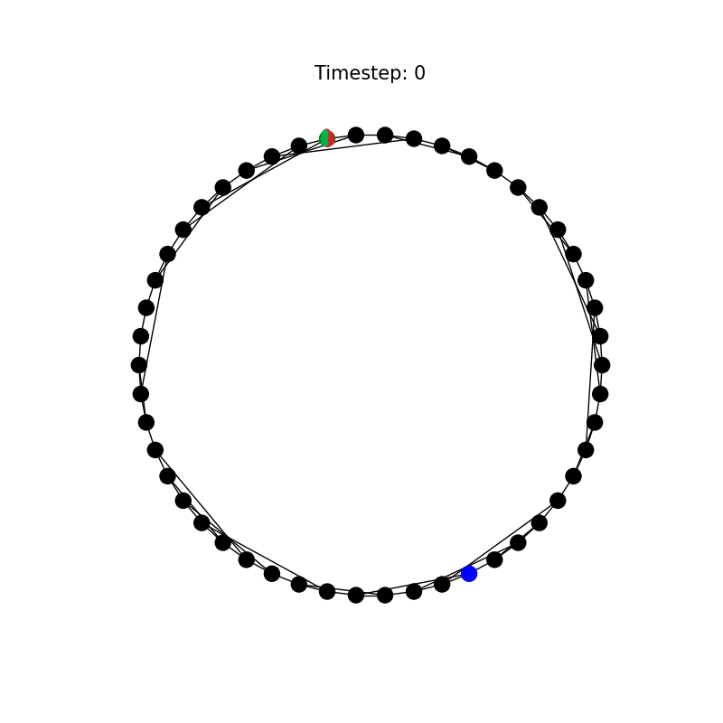
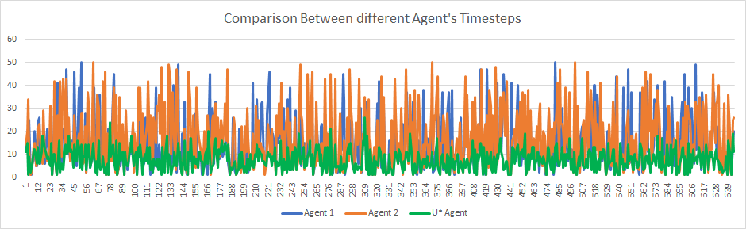
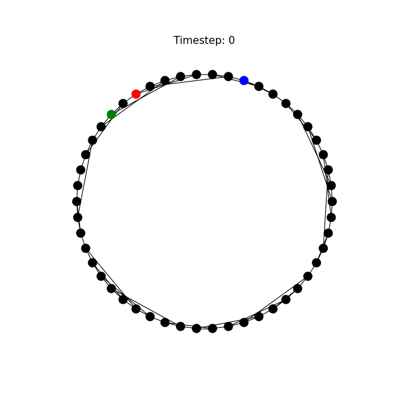
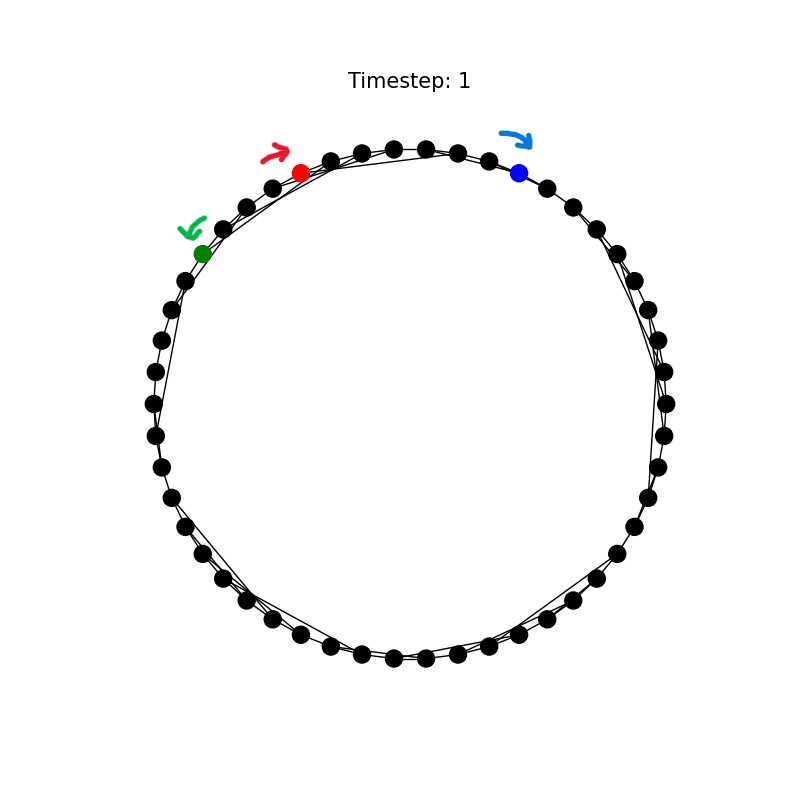
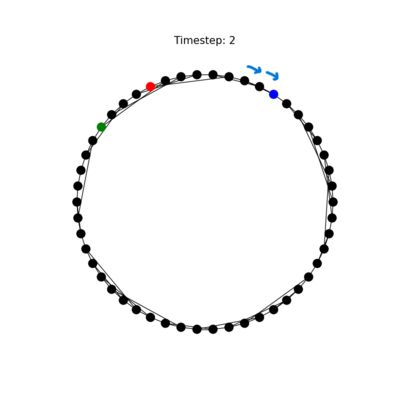
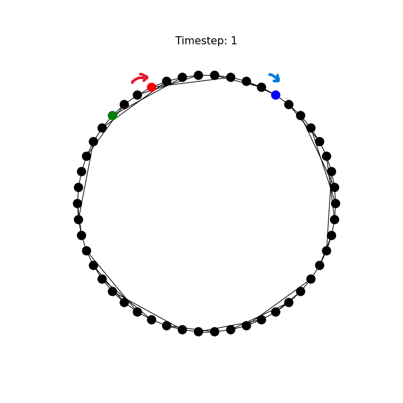
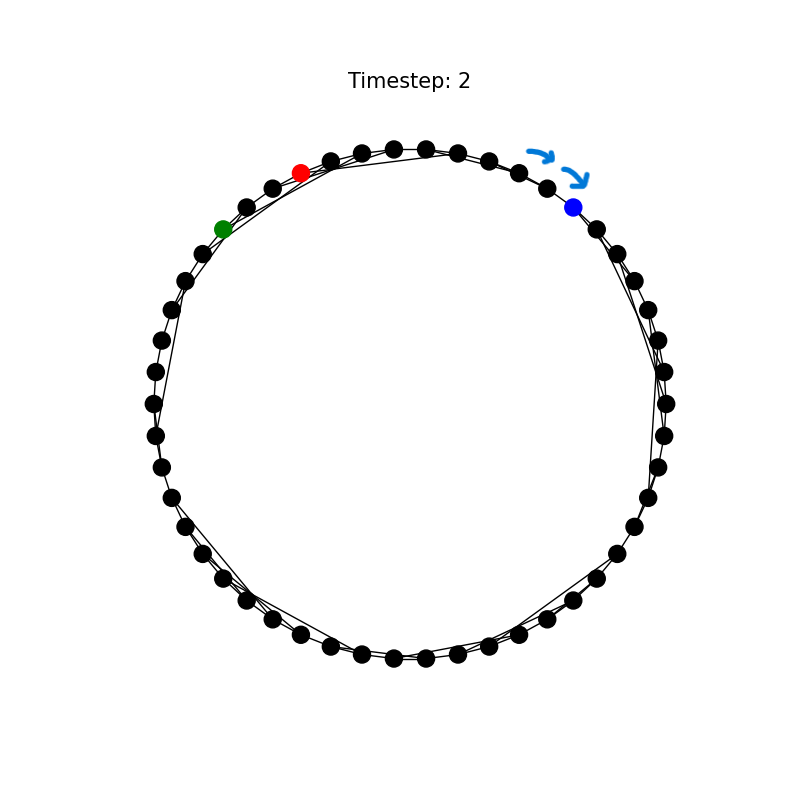
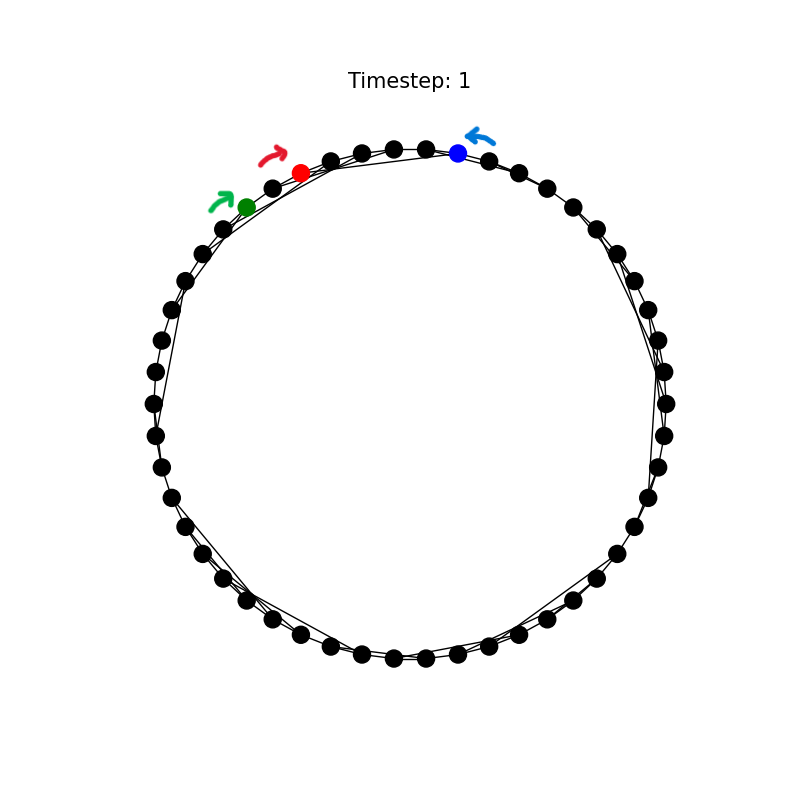
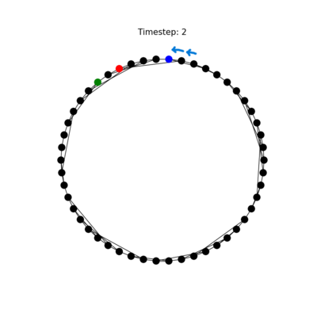

# ${U^*}

## Overview

- The utility, `Ustar` is defined to be the minimal expected number of rounds for the agent to catch the prey.
- With Ustar, an optimal policy can be recovered to ensure the agent can succeed in catching the prey.

## Design

- The U* for any state can be calculated using value iteration: 
    - Value Iteration in our case:
    $$U^*_{k+1}(s) = min_{a∈A(s)} [cost_{s, a}+ \beta\sum_{a∈A(s)} p_{s,s'}^a U^*_k(s') ]$$

- In our implementation $\beta = 1$ because the value of future states should not get discounted as they provide exact value of estimated steps to reach prey.
  
- $cost_{s,a} = 1$ for all steps as this would be counted as cost for agent to move.
  
- $p_{s,s'}^a = P(Prey_{s'}|Prey_s) * P(Predator_{s'}|Predator_s)$ since the states are stochastic. Prey moves randomly and Predator moves according to distracted predator model.

$$U^*_{k+1}(s) = min_{a∈A(s)} [1+ \sum_{a∈A(s)} p_{s,s'}^a U^*_k(s') ]$$

## Algorithm

Value Iteration

```python
Initialize_U*() # with any value

# repeat until convergence
for all state in states:
    for all actions in state:
        Update_U*_according_to_formula()
```

## Implementation

- The initial U(s) ∀ s ∈ state space S is set arbitrarily to a constant, 30.
- The U(s'), where s' implies the states where both the agent and predator exist, is set to a very high value as this is a loss condition. In our implementation, the U* for such a state is always set to 1,000,000 whenever encountered.
- The U(s''), where s'' implies the states where both the agent and prey exist, is set to 0 as we know .
- A prey transition matrix is stored to track the probabilities of where the prey may move to.
- The predator propogated belief is calculated for each state with respect to the agent's next position.
- The U* values converge over time using value iteration until the optimal U* values for each state are obtained. 

## The U* Agent

- Calculates the action which leads to min U* at each step and moves accordingly until game ends.
- Moves that lead to agent to the current predator position are discouraged by giving it a high cost.

## Grey box questions

1. States where agent cannot catch predator: when agent and predator start from the same node. The agent will not be able to catch prey in this situation so $U^*$ for this state is set to $\infty$.
2. Largest possible finite value of $U^*$ for our graph $\approx$ 16.707
   
   Visualization:
   
    `Agent: Blue` `Prey: Green` `Predator: Red`

3. Performance of U* (in terms of timestep to catch Prey) to `Agent 1` and `Agent 2`.

    

    Average Timesteps (measured over 600 iterations):
    - `Agent 1`: 14.3649
    - `Agent 2`: 16.7453
    - `U*Agent`: 7.58540

4. States where U* agent makes different choices:

    - Agent 1 visualization
    
    
    
    - Agent 2 visualization
    
    
    
    - U* Agent visualization
    
    
    

- On comparing the visualizations of each agent, a crucial distinction between Agent1/Agent2 and the U* Agent can be observed:
    - Since the methodology of Agent 1 and Agent 2 were hard-coded a set of rules to make their way to the prey, the agents made it equal priority to move towards the prey while keeping the distance between themselves and the predator non-decreasing at best.
    - The U* Agent had the utility precomputed, so it is aware of where it can catch the prey even if the gap between itself and the predator was closing.
    - Therefore we can notice that the agents are faced with the dilemma of moving towards the prey at the cost of moving towards the predator as well. Agent 1 and 2 are designed to avoid getting close to the predator so they move away. The U* Agent, however, moves towards the prey and predator, while knowing it can avoid the predator. 