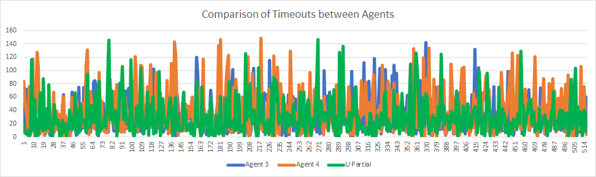

# $U_{partial}$

## Overview

- The $U_{partial}$ refers to the expected utility of a state wherein the prey's position is replaced with a vector of beliefs of where it might be.
- In this case, the prey's position is unknown. This means that the prey's different beliefs result in an infinite number of belief states that causes $U^{*}$ to be tough to compute.

## Design

- The idea here is to compute $U_{partial}$ as an estimate from $U^{*}$ as provided in the writeup:
$$U_{partial}(s_{agent}, s_{predator}, \underbar{p}) = \sum_{s_{prey}} p_{s_{prey}} U^{*}(s_{agent}, s_{predator}, s_{prey})$$
- An agent is designed to follow the estimated utility generated by the aforementioned equation.

## Implementation

- The belief update (transition update) and survey belief are updated the same way as `Agent3` from project 2.
- $U_{partial}$ is calculated for each action in the value iteration.
- In this case $p_{s,s'}^a = P(Predator_{s'}|Predator_s)$

## Observations

- The agent's performance was close to the $U^*$ agent, around a 99.8% win rate.

## Grey Box Questions

1. Comparison to `Agent 3` and `Agent 4` from Project 2 (based on timesteps to catch prey):

    

    Average timesteps to catch prey:
    - `Agent 3`: 29.585
    - `Agent 4`: 38.279
    - `U partial`: 29.937

2. Is this $U_{partial}$ optimal? 

    No it is not optimal as:
    - it takes more timesteps to catch prey
    - does not have 100% winrate

- The state [`upartial`, agent_position, predator_position, prey_vector] is stored in `upartial.csv` if `upartial` < 50, since if the estimate is greater than 50, it means that the path is not an optimal one. 